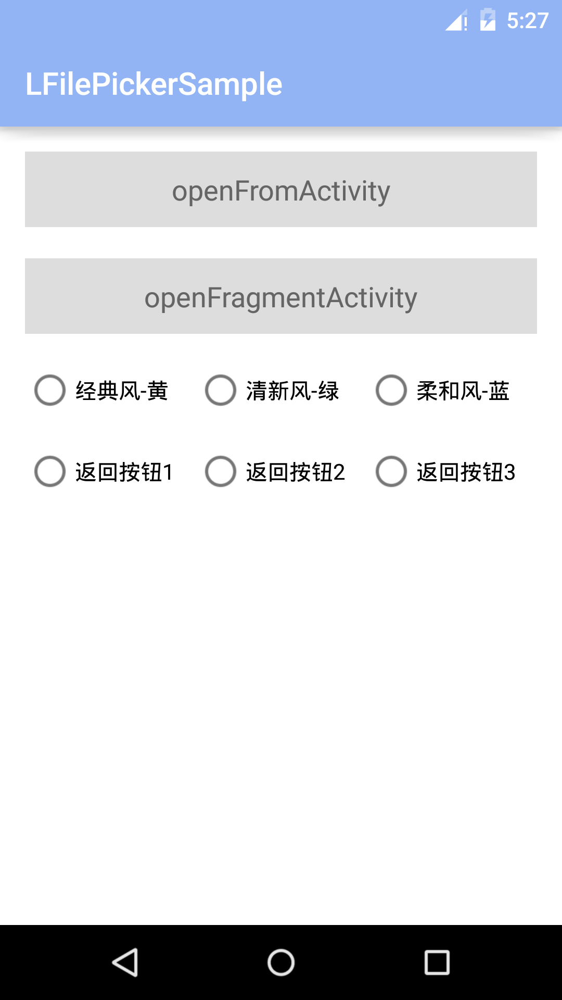
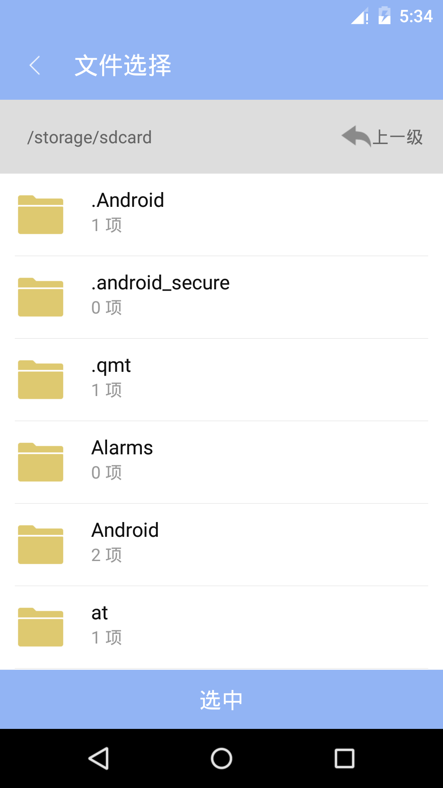
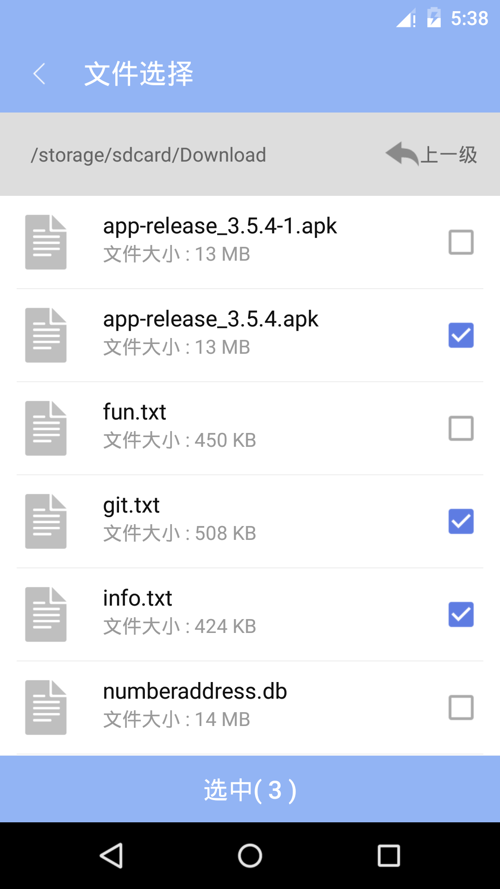
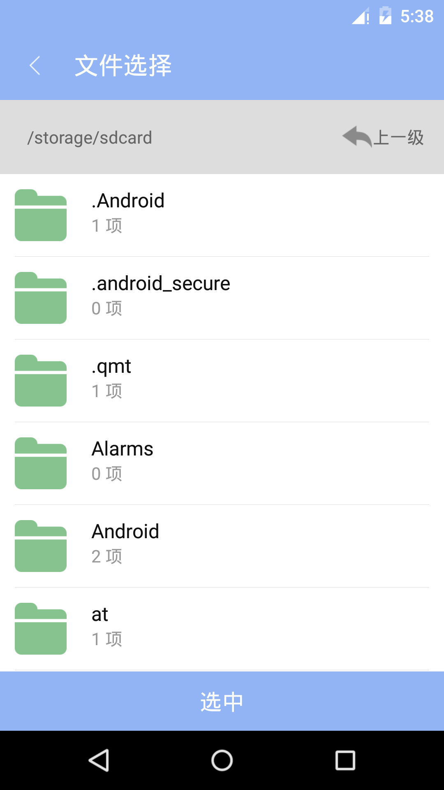
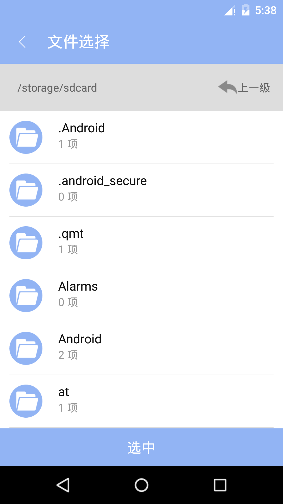
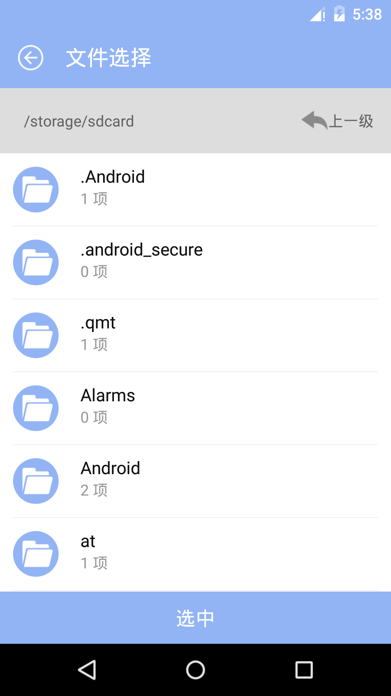
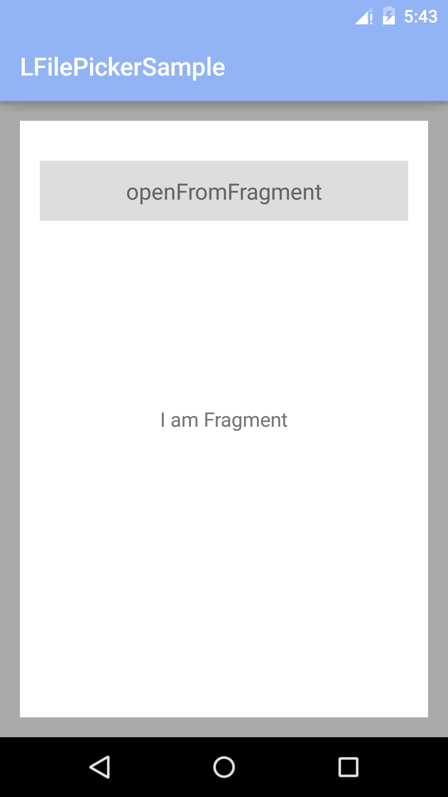

----------
### [中文文档](README_CH.md)
This is a lightweight file selector, it can select files by retrieve phone directory. At the same time contains：

 - A variety of interface style
 - Support file multiple-choice or radio
 - Support the file type filter
 - Support the fragments
 - custom title text and color
 - Internationalization (switch in both Chinese and English)
 - Maximum quantity limitation (withMaxNum)
 - All or all cancel
 - File size filtering
 - Default path specified

### version update：
 #### V1.8.0
 #### V1.7.0
  - Adds an interface to specify the initial display path.
  - The added interface can filter the file size, larger than the specified size, or less than the specified size.
 #### V1.6.0
  - Add folder path selection
 #### V1.5.0
  - Select check to avoid duplication of data
  - Single mode does not show full selection operation
 #### V1.4.0
 - Maximum quantity limitation
 - All or all cancel

### Running effect：
#### dynamic effect（If the picture can't display properly, you can view the screenshot GIF files in the folder）

#### the page：

### Quick to use
#### 1. add reference
    compile 'com.leon:lfilepickerlibrary:1.8.0'

#### 2. add permission

    <uses-permission android:name="android.permission.WRITE_EXTERNAL_STORAGE"/>
   
    
#### 3. open Activity
    int REQUESTCODE_FROM_ACTIVITY = 1000;
    new LFilePicker()
                .withActivity(MainActivity.this)
                .withRequestCode(REQUESTCODE_FROM_ACTIVITY)
                 .withStartPath("/storage/emulated/0/Download")
                 .withIsGreater(false)
                 .withFileSize(500 * 1024)
                .start();
                
#### 4. accept the results of the return

    @Override
    protected void onActivityResult(int requestCode, int resultCode, Intent data) {
        super.onActivityResult(requestCode, resultCode, data);
        if (resultCode == RESULT_OK) {
            if (requestCode == REQUESTCODE_FROM_ACTIVITY) {
               //If it is a file selection mode, you need to get the path collection of all the files selected
                //List<String> list = data.getStringArrayListExtra(Constant.RESULT_INFO);//Constant.RESULT_INFO == "paths"
                List<String> list = data.getStringArrayListExtra("paths");
                Toast.makeText(getApplicationContext(), "selected " + list.size() , Toast.LENGTH_SHORT).show();
                //If it is a folder selection mode, you need to get the folder path of your choice
                String path = data.getStringExtra("path");
                Toast.makeText(getApplicationContext(), "The selected path is:" + path, Toast.LENGTH_SHORT).show();
            }
        }
    }
    
### Interface methods
#### method statement
| method        | statement   |
| --------   | --------- |
| withActivity(Activity activity)   |bind Activity|
| withFragment(Fragment fragment)   |bind Fragment|
| withSupportFragment(Fragment supportFragment)|bind V4 Fragment|
| withRequestCode(int requestCode)  |set the request code|
| withTitle(String title)           |Set the title|
| withTitleColor(String color)      |Set the title color|
| withBackgroundColor(String color) |Set the title background color|
| withIconStyle(int style)          |set the list icon style|
| withBackIcon(int backStyle)       |set back icon style|
| withFileFilter(String[] arrs)     |set the file type filter|
| withMutilyMode(boolean isMutily)  |setting a multiple-choice or radio mode|
| withAddText(String text)          |set the multiselect mode selected text|
| withNotFoundBooks(String text)    |Set the prompt information when no file selected|
| withMaxNum(int num)               |Set the max number of files|
| withChooseMode(boolean chooseMode)|Set the folder selection mode, true (default) to select file, false to select folder|
| withStartPath(String path)        |Set the initial display path|
| withIsGreater(boolean isGreater)  |Set the filter mode,true(default) is greater than the specified size, or false less than the specified size|
| withFileSize(long size)           |Set the size of the specified filter file, and if it is 500K, enter 500*1024|
#### Provide style

 **withIconStyle(int style)** Value model：
 - Constant.ICON_STYLE_YELLOW
 - Constant.ICON_STYLE_BLUE
 - Constant.ICON_STYLE_GREEN
 
 **withBackIcon(int backStyle)** Value model：
 - Constant.BACKICON_STYLEONE
 - Constant.BACKICON_STYLETWO
 - Constant.BACKICON_STYLETHREE
 
  **withFileFilter(String[] arrs)** Value model：

     withFileFilter(new String[]{".txt", ".png", ".docx"})
     
### More detailed usage：[简书：LFilePicker---文件选择利器，各种样式有它就够了](http://www.jianshu.com/p/eeb211e190be)
 
### Thanks
 - [AndroidUtilCode][1]
 - [MaterialFilePicker][2]

----------
If the library is useful to you, welcome to star or fork!
Welcome to visit [blog] [3] for more articles.

## License

Copyright (C) 2017 leonHua

Licensed under the Apache License, Version 2.0 (the "License");
you may not use this file except in compliance with the License.
You may obtain a copy of the License at

http://www.apache.org/licenses/LICENSE-2.0

Unless required by applicable law or agreed to in writing, software
distributed under the License is distributed on an "AS IS" BASIS,
WITHOUT WARRANTIES OR CONDITIONS OF ANY KIND, either express or implied.
See the License for the specific language governing permissions and
limitations under the License.

  [1]: https://github.com/Blankj/AndroidUtilCode
  [2]: https://github.com/nbsp-team/MaterialFilePicker
  [3]: https://leonhua.github.io/
